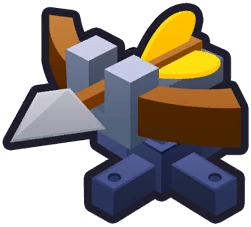

<h1 align="center">Upgradable Shooty Turret</h1>

- Adds a placeable Geraldo Shooty Turret to the shop that can be upgraded.

- There is no shooting animation for upgrade 0, 1, and 2.

- Special thanks to Silentstorm and all those who helped me in 1330 Studios server and BTD6 Modding & Discussion server.

